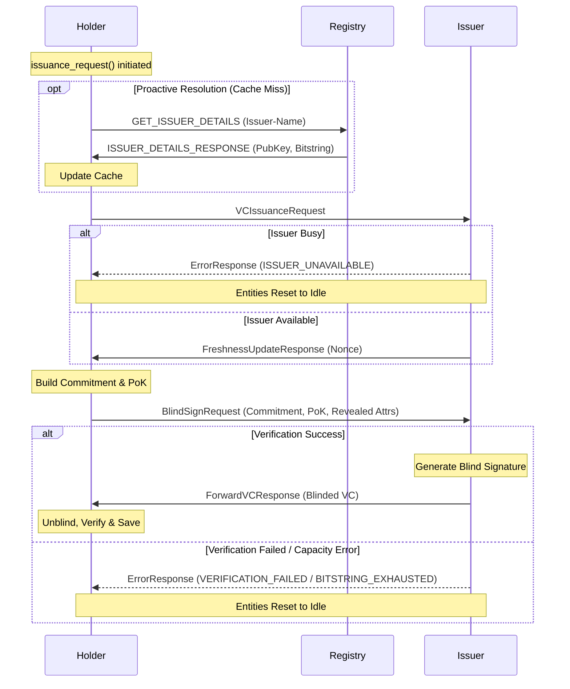
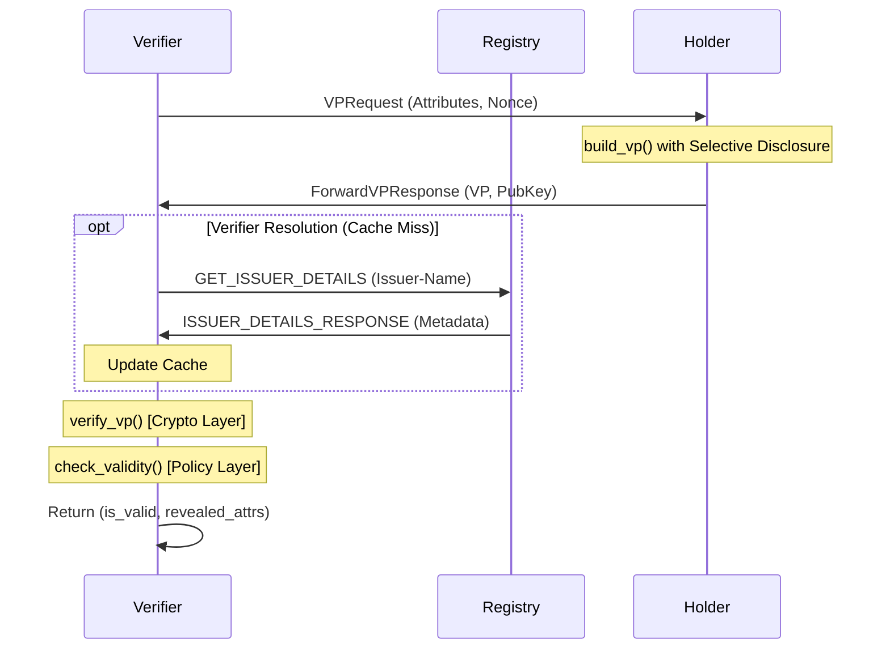
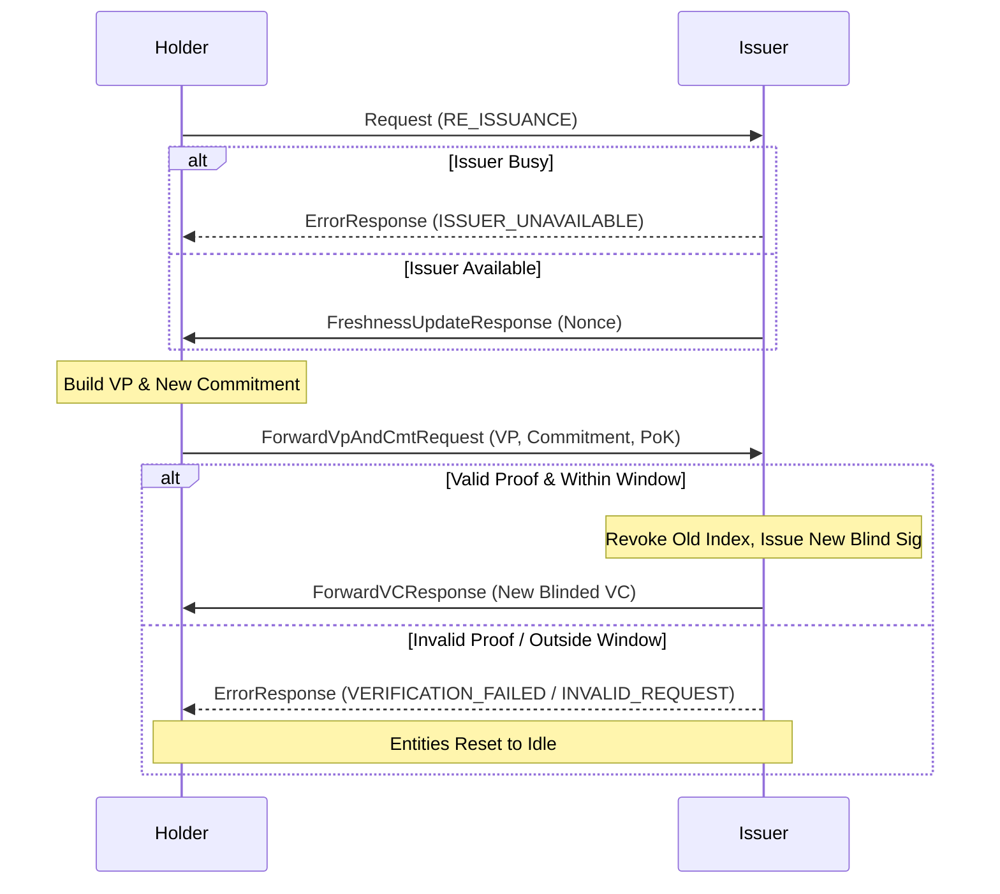

# BBS+ Issuance Protocol — Flow Documentation

This document provides a systematic reference for all cryptographic and administrative interaction flows within the BBS-ISS prototype. It serves as the foundation for designing higher-level application logic and session management.

---

## 1. Core Entities & State

| Entity | Role | Key State |
|--------|------|-----------|
| **Holder** | Prover | Awaiting response (Nonce/VC), Persistent Credentials Store |
| **Issuer** | Authority | Awaiting BlindSign/Commitment, Private Key, Bitstring Manager |
| **Verifier** | Relying Party | Awaiting VP, Public Data Cache |
| **Registry** | Public Ledger | Map of Issuer names to `IssuerPublicData` |

---

## 2. Primary Protocol Flows

### Flow A: 4-Step Blind Issuance
The primary protocol for obtaining a new credential. Utilizes Pedersen commitments to ensure the Issuer never sees the Holder's secret attributes.



#### Issuance Error Scenarios
| Condition | Error Type | Issuer Response | Holder Action |
|-----------|------------|-----------------|---------------|
| Concurrent session attempt | `ISSUER_UNAVAILABLE` | `ErrorResponse` | State reset; backoff and retry. |
| Commitment PoK invalid | `VERIFICATION_FAILED` | `ErrorResponse` | State reset; investigate tampering. |
| Bitstring full (no reuse) | `BITSTRING_EXHAUSTED`| `ErrorResponse` | Abort; Issuer must expand bitstring. |
| Out-of-order message | `INVALID_STATE` | `ErrorResponse` | Hard reset of both participants. |

---

### Flow B: Verifiable Presentation (ZKP)
The protocol for selectively disclosing attributes. Note: Verifier does not send protocol-level errors; verification failures result in `False` return values.



---

### Flow C: Credential Re-issuance
Renewal flow combining Proof of Possession (VP) and new Blinded Commitment.



#### Re-issuance Error Scenarios
| Condition | Error Type | Issuer Response | Logic |
|-----------|------------|-----------------|-------|
| Request > Window days | `INVALID_REQUEST` | `ErrorResponse` | Prevents renewal of stale credentials. |
| VP or Commitment invalid| `VERIFICATION_FAILED` | `ErrorResponse` | Prevents spoofing or PoK replay. |

---

## 3. Administrative (Registry) Flows

| Flow | Request Type | Success Response | Notes |
|------|--------------|------------------|-------|
| **Registration** | `REGISTER_ISSUER_DETAILS` | `ISSUER_DETAILS_RESPONSE` | Fails if name is taken. |
| **Update** | `UPDATE_ISSUER_DETAILS` | `ISSUER_DETAILS_RESPONSE` | Used for bitstring rotation. |
| **Bulk Sync** | `BULK_ISSUER_DETAILS_REQUEST`| `BULK_ISSUER_DETAILS_RESPONSE`| Full registry dump. |

---

## 4. The ErrorResponse Model

The `ErrorResponse` is a terminal protocol message. Receiving it **forces** an entity to clear its pending state and return to `idle`.

### Message Structure
```json
{
  "request_type": "ERROR",
  "original_request_type": "ISSUANCE",
  "error_type": "VERIFICATION_FAILED",
  "message": "Blinded commitment proof verification failed"
}
```

### ErrorType Enumeration
1.  **`ISSUER_UNAVAILABLE`** (1): Issuer state is locked by another interaction.
2.  **`VERIFICATION_FAILED`** (2): ZKP, PoK, or Signature verification failed.
3.  **`INVALID_STATE`** (3): Unexpected message received for current entity state.
4.  **`INVALID_REQUEST`** (4): Request logic failed (e.g. outside re-issuance window).
5.  **`BITSTRING_EXHAUSTED`** (5): No available indices for issuance.

---

## 5. Technical Reference Appendix

### RequestType (Enum)
| Value | Member | Description |
|-------|--------|-------------|
| 1 | `ISSUANCE` | Initiates the 4-step blind issuance flow. |
| 2 | `RE_ISSUANCE` | Initiates the credential renewal flow. |
| 3 | `BLIND_SIGN` | Submits blinded commitment and PoK to the Issuer. |
| 5 | `FRESHNESS` | Carries the Issuer's challenge nonce back to the Holder. |
| 6 | `VP_REQUEST` | Verifier's request for specific attributes and a nonce-bound proof. |
| 7 | `FORWARD_VC` | Issuer's response containing the blinded signature. |
| 8 | `FORWARD_VP` | Holder's response containing the ZKP and revealed attributes. |
| 10 | `ERROR` | Terminal failure signal used across all protocols. |
| 11 | `FORWARD_VP_AND_CMT` | Submits proof of possession + new commitment for re-issuance. |
| 12 | `REGISTER_ISSUER_DETAILS` | Announces Issuer metadata to the Registry. |
| 13 | `UPDATE_ISSUER_DETAILS` | Updates existing Issuer metadata (e.g. rotated bitstring). |
| 14 | `GET_ISSUER_DETAILS` | Entity query for a specific Issuer's metadata. |
| 15 | `ISSUER_DETAILS_RESPONSE` | Single-issuer data payload from the Registry. |
| 16 | `BULK_ISSUER_DETAILS_REQUEST`| Request for full registry state. |
| 17 | `BULK_ISSUER_DETAILS_RESPONSE`| Full registry data payload. |

### Message Payload Cheat Sheet
| Request Class | Key Fields | Purpose |
|---------------|------------|---------|
| `VCIssuanceRequest` | — | Signal start of issuance session. |
| `FreshnessUpdateResponse`| `nonce` | Challenge for cryptographic binding. |
| `BlindSignRequest` | `commitment`, `proof`, `revealed_attributes` | Pedersen commitment and proof of knowledge. |
| `ForwardVCResponse` | `vc` (VerifiableCredential) | Carries the BBS+ signature (blinded or clear). |
| `VPRequest` | `requested_attributes`, `nonce` | Verifier's selective disclosure requirements. |
| `ForwardVPResponse` | `vp` (VerifiablePresentation), `pub_key` | The ZKP envelope and revealed data. |
| `ForwardVpAndCmtRequest`| `vp`, `commitment`, `proof` | Combined PoP and new commitment for re-issuance. |
| `ErrorResponse` | `error_type`, `original_request_type` | Diagnostic data for protocol recovery. |
| `IssuerDetailsResponse` | `issuer_data` (IssuerPublicData) | Public key, bitstring, and epoch configuration. |
