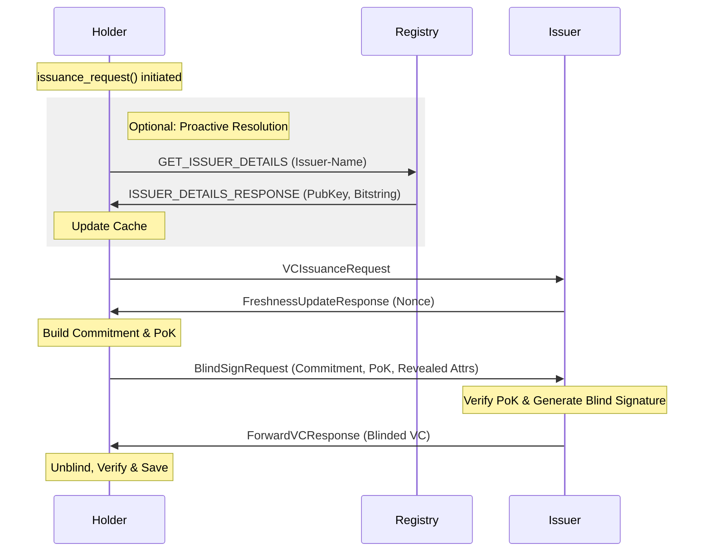
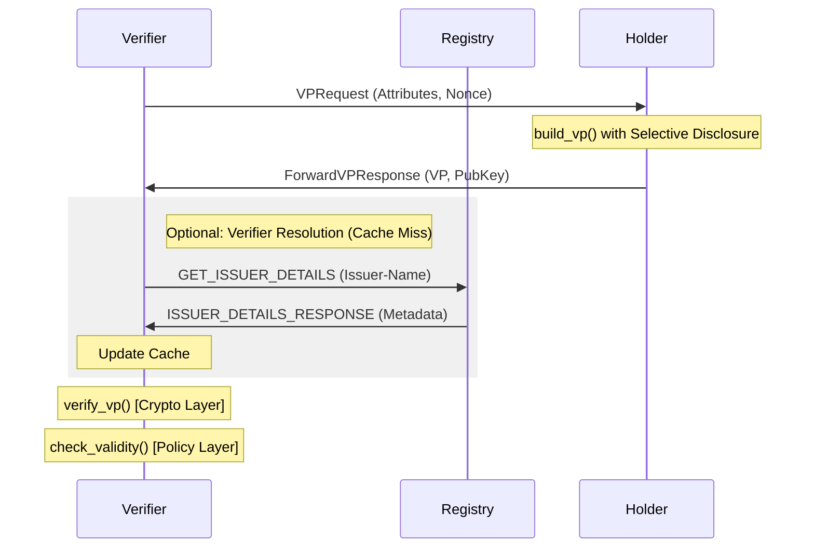
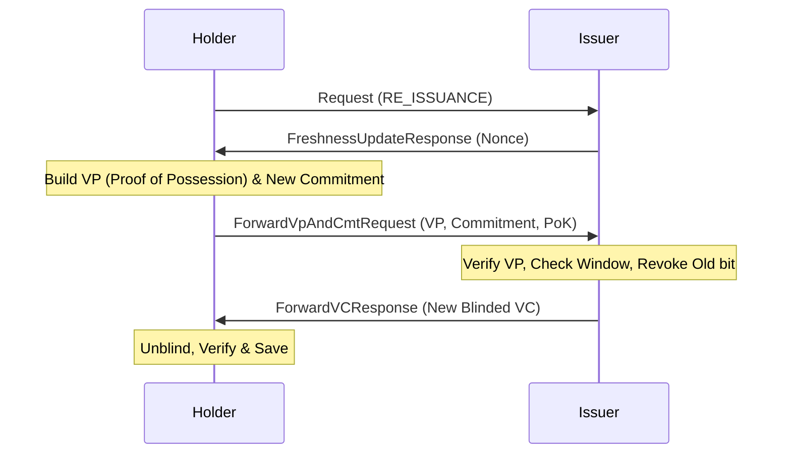

# BBS+ Issuance Protocol — Flow Documentation

This document provides a systematic reference for all cryptographic and administrative interaction flows within the BBS-ISS prototype. It serves as the foundation for designing higher-level application logic and session management.

---

## 1. Core Entities & State

| Entity | Role | Key State |
|--------|------|-----------|
| **Holder** | Prover | Awaiting response (Nonce/VC), Persistent Credentials Store |
| **Issuer** | Authority | Awaiting BlindSign/Commitment, Private Key, Bitstring Manager |
| **Verifier** | Relying Party | Awaiting VP, Public Data Cache |
| **Registry** | Public Ledger | Map of Issuer names to `IssuerPublicData` |

---

## 2. Primary Protocol Flows

### Flow A: 4-Step Blind Issuance
The primary protocol for obtaining a new credential. Utilizes Pedersen commitments to ensure the Issuer never sees the Holder's secret attributes (e.g., `linkSecret`).

**State Transitions:**
- **Issuer**: `idle` -> `awaiting_blind_sign` -> `idle`.
- **Holder**: `idle` -> `awaiting_freshness` -> `awaiting_vc` -> `idle`.

---

### Flow B: Verifiable Presentation (ZKP)
The protocol for selectively disclosing attributes to a Verifier.

**Validity Checks (Policy Layer):**
1. **Expiration**: `now < validUntil`.
2. **Revocation**: Bit at `revocationMaterial` index in cached bitstring is `0`.

---

### Flow C: Credential Re-issuance
A composite protocol for renewing an expiring credential while maintaining attribute privacy.

**Security Constraints:**
- **Window Enforcement**: Rejected if `now` is too far from `validUntil`.
- **Atomic Revocation**: The Issuer revokes the old bit index *only* after validating the VP.

---

## 3. Administrative (Registry) Flows

### Registry Sync (Proactive/Lazy)
Used by Verifiers and Holders to maintain an up-to-date view of the network authorities.

| Flow | Message Sequence | Trigger |
|------|------------------|---------|
| **Specific Lookup** | `GET_ISSUER_DETAILS` -> `ISSUER_DETAILS_RESPONSE` | Cache miss during issuance or presentation. |
| **Bulk Sync** | `BULK_ISSUER_DETAILS_REQUEST` -> `BULK_ISSUER_DETAILS_RESPONSE` | App startup or periodic refresh. |
| **Registration** | `REGISTER_ISSUER_DETAILS` -> `ISSUER_DETAILS_RESPONSE` | Issuer initialization. |
| **Bitstring Rotation** | `UPDATE_ISSUER_DETAILS` -> `ISSUER_DETAILS_RESPONSE` | Issuer extends capacity or revokes a bit. |

---

## 4. Error Handling & State Recovery

The protocol is designed to be "self-healing" through structured error signaling and high-level resets.

### Case 1: Protocol Failure (Issuer-Side)
If the Issuer encounters an error (Busy, Invalid Proof, Bitstring Exhausted):
1. Issuer catches exception.
2. Issuer returns `ErrorResponse`.
3. **Issuer resets to `idle` internally.**
4. Holder receives `ErrorResponse`.
5. **Holder calls `reset()` and returns to `idle`.**

### Case 2: Protocol Hang (Network/Channel Timeout)
If a message is lost (common in QR/Close-Range channels):
1. Application layer (Manager) detects a timeout.
2. **Manager calls `entity.reset()` on both participants.**
3. Internal state machines are purged; entities are ready for a new session.

### Error Types Matrix

| Error Type | Meaning | Recovery Action |
|------------|---------|-----------------|
| `ISSUER_UNAVAILABLE` | Issuer is in another session | Retry with exponential backoff |
| `VERIFICATION_FAILED` | Cryptographic proof invalid | Abort session, investigate tampering |
| `BITSTRING_EXHAUSTED` | Issuer capacity reached | Issuer must `extend_bitstring` and `UPDATE` Registry |
| `INVALID_STATE` | Out-of-order message received | Reset both entities, restart flow |
| `INVALID_REQUEST` | Request malformed or out of window | Abort session |
